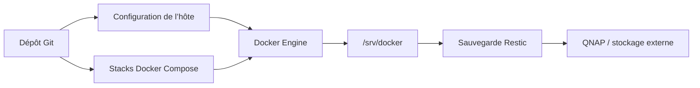

# 🏠 Docker Homelab

> Installation, configuration, déploiement et reconstruction reproductible d’un
> homelab Docker.


Ce dépôt est la **source de vérité** du homelab : il contient tout ce qui est
nécessaire pour préparer l’hôte, déployer les services et reconstruire la
machine après une panne. L’installation actuellement validée tourne sur un
Raspberry Pi 4 sous Debian/Raspberry Pi OS 13 arm64, mais la configuration est
organisée pour faciliter une future migration vers un autre matériel.

Les fichiers Compose et les modèles de configuration sont versionnés. Les
secrets, données applicatives et bibliothèques multimédias restent hors de Git
et sont sauvegardés séparément avec Restic.

## Sommaire

- [Vue d’ensemble](#vue-densemble)
- [Services](#services)
- [Organisation du dépôt](#organisation-du-dépôt)
- [Installation rapide](#installation-rapide)
- [Référence des scripts](#référence-des-scripts)
- [Monter un SSD USB](#monter-un-ssd-usb)
- [Déployer et administrer les stacks](#déployer-et-administrer-les-stacks)
- [Ajouter une stack](#ajouter-une-stack)
- [Sauvegarde et restauration](#sauvegarde-et-restauration)
- [Sécurité et portabilité](#sécurité-et-portabilité)
- [Documentation](#documentation)

## Vue d’ensemble



| Élément | Valeur actuelle |
|---|---|
| Hôte validé | Raspberry Pi 4, arm64 |
| Système | Debian/Raspberry Pi OS 13 |
| Racine Docker | `/srv/docker` |
| Réseau partagé | `proxy` |
| Sauvegarde | Restic vers un partage QNAP chiffré |
| Fuseau horaire | `Europe/Paris` |

## Services

### Infrastructure

| Service | Rôle |
|---|---|
| **Pi-hole** | DNS local et filtrage réseau |
| **Nginx Proxy Manager** | reverse proxy et certificats TLS |
| **wg-easy** | accès distant WireGuard |
| **Homarr** | portail d’accès aux services |

### Monitoring

| Service | Rôle |
|---|---|
| **Uptime Kuma** | disponibilité et alertes |
| **Portainer** | administration de Docker |
| **Beszel** | métriques de l’hôte et des conteneurs |
| **Dozzle** | consultation des logs Docker |
| **Freebox Dashboard** | supervision de la Freebox |

### Media stack

La media stack n’est pas encore intégrée. Elle sera ajoutée à partir d’un
Compose dédié comprenant notamment Prowlarr, Sonarr et Radarr.

## Organisation du dépôt

```text
homelab/
├── config/                     configuration de l’hôte
│   ├── apt/                    dépôts APT Debian, Docker et Raspberry Pi
│   ├── nftables/               pare-feu de l’hôte actuel
│   ├── ssh/                    authentification et durcissement SSH
│   └── systemd/                sauvegarde Restic et pare-feu
├── docs/                       procédures détaillées
├── dotfiles/                   environnement utilisateur
├── inventory/
│   ├── apt-packages.txt        paquets installés sur l’hôte
│   └── stacks.manifest         catalogue utilisé par deploy.sh
├── scripts/                    installation et opérations
└── stacks/
    ├── infrastructure/         DNS, proxy, VPN et portail
    └── monitoring/             supervision et administration
```

Le classement par catégorie existe uniquement dans Git. Au déploiement, chaque
stack est synchronisée dans `/srv/docker/<nom-de-la-stack>` afin de conserver
des chemins simples et de ne pas déplacer les données existantes.

## Installation rapide

### Prérequis

- un Raspberry Pi 4 ou un hôte compatible fraîchement installé ;
- Debian/Raspberry Pi OS 13 arm64 pour le parcours officiellement validé ;
- l’utilisateur `eldayia` présent sur l’hôte, sauf surcharge avec
  `HOMELAB_USER` ;
- un accès `sudo` et une clé SSH fonctionnelle ;
- l’accès au dépôt privé GitHub ;
- pour la sauvegarde, un partage QNAP joignable et un mot de passe Restic.
- pour le stockage, un SSD USB existant ou un disque dont le contenu peut être
  entièrement effacé ; ext4 est recommandé.

### Nouvel hôte

```bash
git clone git@github.com:Eldayia/homelab.git ~/homelab
cd ~/homelab

# 1. Installer les paquets, Docker et la configuration système
sudo ./scripts/install-host.sh --configure-storage

# 2. Prévisualiser puis appliquer le réseau statique
sudo ./scripts/configure-network.sh
sudo ./scripts/configure-network.sh --apply

# 3. Configurer le stockage et la sauvegarde Restic
sudo ./scripts/configure-backup.sh

# 4. Lister puis déployer les services
./scripts/deploy.sh list
./scripts/deploy.sh up infrastructure
./scripts/deploy.sh up monitoring

# 5. Contrôler le dépôt et les Compose
./scripts/verify.sh
```

Après `install-host.sh`, se reconnecter pour prendre en compte le groupe
`docker` et le shell Zsh. Avant tout `deploy.sh up`, remplacer les valeurs
`CHANGE_ME` dans les fichiers `/srv/docker/<stack>/.env`.

### Reconstruction après incident

Sur un hôte de remplacement, restaurer les données **avant** de démarrer les
stacks :

```bash
sudo ./scripts/install-host.sh
sudo ./scripts/configure-network.sh --apply
sudo ./scripts/configure-backup.sh
sudo ./scripts/restore-data.sh --snapshot latest --confirm
./scripts/deploy.sh up --all
./scripts/verify.sh
```

Lire impérativement la
[procédure de reprise après sinistre](docs/disaster-recovery.md) avant une
restauration dans `/`.

## Référence des scripts

| Script | Usage principal | Privilèges |
|---|---|---|
| `install-host.sh` | préparer complètement l’hôte | root / `sudo` |
| `configure-network.sh` | définir le hostname et l’IPv4 statique | root / `sudo` |
| `configure-storage.sh` | préparer ou monter durablement un SSD USB | root / `sudo` |
| `configure-media-storage.sh` | monter Download et Multimedia du QNAP en NFS | root / `sudo` |
| `configure-backup.sh` | monter le QNAP et initialiser Restic | root / `sudo` |
| `deploy.sh` | synchroniser et piloter les stacks | utilisateur Docker |
| `backup.sh` | exécuter la sauvegarde Restic | root via systemd |
| `restore-data.sh` | restaurer `/srv/docker` | root / `sudo` |
| `check-secrets.sh` | détecter des secrets accidentellement présents | utilisateur |
| `verify.sh` | valider scripts, secrets et Compose | utilisateur |

### `install-host.sh` — préparer l’hôte

```bash
sudo ./scripts/install-host.sh [--activate-firewall] [--enable-backup] [--configure-storage] [--configure-media-storage]
```

Le script :

1. vérifie Debian 13 arm64 ;
2. installe les paquets de `inventory/apt-packages.txt` ;
3. installe Docker Engine et le plugin Compose si nécessaire ;
4. configure les dotfiles, Zsh, SSH, nftables et les unités systemd ;
5. ajoute l’utilisateur au groupe `docker` ;
6. prépare `/srv/docker` et crée le réseau Docker externe `proxy` ;
7. active Docker, SSH et Cockpit.

| Option ou variable | Effet |
|---|---|
| `--activate-firewall` | active immédiatement `rpi-firewall.service` |
| `--enable-backup` | active le timer Restic si le montage et le mot de passe existent déjà |
| `--configure-storage` | lance l’assistant interactif de préparation ou montage du SSD USB |
| `--configure-media-storage` | monte les exports médias du QNAP en NFSv4.1 |
| `HOMELAB_USER` | utilisateur configuré, `eldayia` par défaut |
| `HOMELAB_ROOT` | racine des stacks, `/srv/docker` par défaut |
| `ALLOW_UNSUPPORTED=1` | contourne le contrôle Debian 13 arm64 après vérification manuelle |

> **Attention :** n’activer le pare-feu qu’en conservant une deuxième session
> SSH ouverte. `ALLOW_UNSUPPORTED=1` ne rend pas automatiquement le dépôt
> compatible avec un autre OS ou une autre architecture.

### `configure-network.sh` — configurer le réseau

```bash
# Prévisualisation sans modification
sudo ./scripts/configure-network.sh

# Application effective
sudo ./scripts/configure-network.sh --apply
```

Sans `--apply`, le script affiche uniquement la configuration prévue. Avec
`--apply`, il configure le hostname, le fuseau horaire, la locale, le clavier et
la connexion NetworkManager, puis réactive celle-ci.

| Variable | Valeur par défaut |
|---|---|
| `NM_CONNECTION` | `netplan-eth0` |
| `HOST_NAME` | `rpi4` |
| `LAN_ADDRESS` | `192.168.1.240/24` |
| `LAN_GATEWAY` | `192.168.1.1` |
| `LAN_DNS_SERVERS` | `192.168.1.240,194.242.2.5,1.1.1.1` |

Exemple avec le modèle versionné :

```bash
set -a
source config/network.env.example
set +a
sudo -E ./scripts/configure-network.sh
sudo -E ./scripts/configure-network.sh --apply
```

> **Attention :** l’application peut interrompre la session SSH. Utiliser une
> console locale ou garder une seconde session ouverte.

### `configure-storage.sh` — préparer ou monter un SSD USB

L’assistant peut être lancé pendant l’installation avec
`install-host.sh --configure-storage`, ou indépendamment :

```bash
sudo ./scripts/configure-storage.sh
```

Il affiche les disques détectés, puis propose de monter une partition existante
ou d’effacer et préparer un disque USB entier. Selon le mode choisi, il :

- vérifie qu’il s’agit d’une partition et non du disque entier ;
- refuse les partitions racine et de démarrage ;
- peut créer explicitement une table GPT et une partition ext4 unique ;
- refuse tout formatage d’un disque non USB, monté ou référencé dans `fstab` ;
- refuse de masquer un point de montage contenant déjà des fichiers ;
- ajoute une entrée par UUID à `/etc/fstab` ;
- utilise `nofail` et une unité d’automontage systemd pour ne pas bloquer le
  démarrage si le SSD est absent ;
- monte le volume et vérifie que l’utilisateur peut y écrire ;
- sauvegarde et valide `/etc/fstab` avant de conserver la modification.

Exécution guidée recommandée :

```bash
# Efface entièrement /dev/sda, puis le prépare pour tout le homelab
sudo ./scripts/configure-storage.sh \
  --format \
  --device /dev/sda \
  --mount-point /srv \
  --owner eldayia
```

| Option ou variable | Valeur / usage |
|---|---|
| `--device`, `STORAGE_DEVICE` | partition à monter, ou disque entier avec `--format` |
| `--format` | efface le disque entier et crée GPT + une partition ext4 |
| `--mount-point`, `STORAGE_MOUNT_POINT` | `/srv` pour tout le homelab ou `/srv/media` pour les médias seuls |
| `--owner`, `STORAGE_OWNER` | utilisateur propriétaire du stockage |
| `--yes` | saute la confirmation d’un simple montage, jamais celle du formatage |

Les formats pris en charge sont ext2/3/4, XFS, Btrfs et NTFS. **Ext4 est le
choix recommandé** pour un SSD dédié au homelab. NTFS est utile si le disque
doit aussi être lu sous Windows, mais offre un modèle de permissions moins
adapté aux services Docker.

Le profil `/srv` place sur le SSD toutes les données persistantes des Compose
(`/srv/docker`) ainsi que les médias (`/srv/media`). Les images, couches et logs
internes du moteur Docker restent dans `/var/lib/docker` sur le disque système.
Pour placer également le système et le moteur Docker sur SSD, la solution la
plus simple et la plus cohérente est de démarrer directement Raspberry Pi OS
depuis le SSD.

> **Le formatage est irréversible.** Il exige de sélectionner le disque entier,
> affiche son modèle, sa taille et son numéro de série, puis impose de saisir
> exactement `ERASE /dev/…`. Cette confirmation reste obligatoire même avec
> `--yes`.

### `configure-media-storage.sh` — monter les partages médias du QNAP

Ce script prépare le stockage de la future media-stack sans déployer de
conteneur :

```bash
sudo ./scripts/configure-media-storage.sh
```

Dans QTS, configurer l’accès hôte NFS de **Download** et **Multimedia** ainsi :

| Réglage QTS | Valeur |
|---|---|
| hôte autorisé | `192.168.1.240`, IP fixe du Raspberry Pi |
| autorisation | lecture/écriture |
| sécurité | `sys` |
| sync / secure | activés, `wdelay` |
| squash | écraser tous les utilisateurs |
| UID anonyme | `media-docker` |
| GID anonyme | groupe de `media-docker` |

Le compte et le groupe `media-docker` doivent également disposer des droits
QTS classiques en lecture/écriture sur les deux dossiers partagés. NFS ne
transmet pas un nom d’utilisateur ou un mot de passe : QTS mappe toutes les
requêtes du Pi vers cette identité grâce au squash.

L’assistant :

- teste d’abord les deux exports dans des dossiers temporaires ;
- vérifie que `media-docker` peut réellement créer un fichier ;
- refuse de masquer un point de montage local non vide ;
- sauvegarde et valide `/etc/fstab` avant sa modification ;
- restaure l’ancien `fstab` si l’un des montages échoue ;
- configure les montages persistants suivants :

```text
192.168.1.250:/Download   -> /mnt/nas/downloads
192.168.1.250:/Multimedia -> /mnt/nas/multimedia
```

Avec NFSv4.1, les exports QNAP sont `/Download` et `/Multimedia`, sans le
préfixe `/share` utilisé par NFSv3. Le SSD local reste séparé sous
`/srv/media/downloads/torrents`.

| Variable | Valeur par défaut |
|---|---|
| `QNAP_HOST` | `192.168.1.250` |
| `NFS_VERSION` | `4.1` |
| `DOWNLOAD_EXPORT` | `/Download` |
| `MULTIMEDIA_EXPORT` | `/Multimedia` |
| `DOWNLOAD_MOUNT` | `/mnt/nas/downloads` |
| `MULTIMEDIA_MOUNT` | `/mnt/nas/multimedia` |

Contrôle après configuration :

```bash
findmnt -T /mnt/nas/downloads -o SOURCE,TARGET,FSTYPE,OPTIONS
findmnt -T /mnt/nas/multimedia -o SOURCE,TARGET,FSTYPE,OPTIONS
```

### `configure-backup.sh` — initialiser les sauvegardes

```bash
sudo QNAP_EXPORT=/RaspberryBackups ./scripts/configure-backup.sh
```

Avant de le lancer, activer NFS sur le QNAP et autoriser uniquement l’adresse IP
fixe du Raspberry Pi en lecture/écriture sur l’export. Le script demande
interactivement le mot de passe Restic, puis :

- crée le fichier du mot de passe Restic en mode `600` ;
- configure un montage NFSv4.1 persistant dans `/etc/fstab` ;
- remplace l’ancienne entrée utilisant le même point de montage après avoir
  sauvegardé `fstab` ;
- vérifie que le partage est bien monté en NFS et accessible en écriture ;
- valide le mot de passe sur un dépôt existant avant de remplacer le fichier
  local ;
- monte le partage et initialise le dépôt Restic si nécessaire ;
- installe `backup.sh` sous `/srv/docker/backup/` ;
- installe et active `docker-restic-backup.timer`.

| Variable | Valeur par défaut / usage |
|---|---|
| `QNAP_HOST` | `192.168.1.250` |
| `QNAP_EXPORT` | `/RaspberryBackups`, chemin NFSv4 du partage QNAP |
| `NFS_VERSION` | `4.1` |
| `MOUNT_POINT` | `/mnt/qnap-backups` |
| `RESTIC_REPOSITORY` | `<montage>/restic-rpi` |
| `RESTIC_PASSWORD` | évite la saisie interactive ; ne pas stocker dans Git |
| `KUMA_PUSH_URL` | URL Push facultative pour notifier Uptime Kuma |

NFS n’utilise ici aucun mot de passe : l’accès est contrôlé par l’adresse IP
autorisée sur le QNAP. Ne pas exposer NFS sur Internet. Le dépôt reste chiffré
par Restic, mais le montage doit être réservé au réseau local de confiance.

Avec QTS, le chemin diffère selon la version du protocole : NFSv4 utilise
`/RaspberryBackups`, tandis que NFSv3 utilise généralement
`/share/RaspberryBackups`. Le projet utilise NFSv4.1.

Contrôle après configuration :

```bash
mountpoint /mnt/qnap-backups
findmnt -T /mnt/qnap-backups -o SOURCE,TARGET,FSTYPE,OPTIONS
systemctl list-timers docker-restic-backup.timer
sudo systemctl start docker-restic-backup.service
sudo journalctl -u docker-restic-backup.service -n 100 --no-pager
```

### `deploy.sh` — piloter les stacks

```bash
./scripts/deploy.sh ACTION [--all | CATÉGORIE | STACK...]
```

Une sélection peut être un nom de stack (`pihole`), une catégorie entière
(`infrastructure`) ou toutes les stacks actives (`--all`).

| Action | Comportement |
|---|---|
| `list` | affiche catégorie, nom et état de chaque stack du manifeste |
| `sync` | copie les fichiers vers `/srv/docker/<stack>` sans démarrer Docker |
| `up` | synchronise, valide puis lance avec `docker compose up -d --build` |
| `pull` | télécharge les images sans recréer les conteneurs |
| `status` | affiche `docker compose ps` pour la sélection |

Exemples :

```bash
# Voir ce qui est disponible
./scripts/deploy.sh list

# Préparer toute l’infrastructure sans la démarrer
./scripts/deploy.sh sync infrastructure

# Déployer deux stacks précises
./scripts/deploy.sh up pihole uptime-kuma

# Mettre à jour puis recréer le monitoring
./scripts/deploy.sh pull monitoring
./scripts/deploy.sh up monitoring

# Voir l’état de toutes les stacks actives
./scripts/deploy.sh status --all

# Utiliser une autre racine de déploiement
HOMELAB_ROOT=/srv/homelab ./scripts/deploy.sh sync --all
```

Lors du premier `sync`, un `.env.example` devient un `.env` local en mode `600`.
Un `.env` existant n’est jamais écrasé. L’action `up` refuse de démarrer si un
placeholder `CHANGE_ME` obligatoire est encore présent. Le réseau Docker
`proxy` est créé automatiquement pour toutes les actions sauf `status`.

### `backup.sh` — sauvegarder les données Docker

Ce script est normalement lancé par systemd, pas directement :

```bash
sudo systemctl start docker-restic-backup.service
sudo journalctl -u docker-restic-backup.service -f
```

Il vérifie le montage et le dépôt Restic, verrouille l’exécution pour éviter deux
sauvegardes simultanées, met temporairement en pause tous les conteneurs, puis
sauvegarde `/srv/docker`. Les conteneurs sont repris même si le script échoue.

La rétention conserve 7 sauvegardes quotidiennes, 5 hebdomadaires, 12
mensuelles et 3 annuelles. Le dimanche, un `prune` et un contrôle de 10 % des
données sont effectués ; les autres jours, seule la structure est vérifiée. Si
une URL Push Kuma a été configurée, le résultat est envoyé à Uptime Kuma.

> **Impact :** les conteneurs sont brièvement mis en pause. Le script échoue
> volontairement si aucun conteneur n’est actif.

### `restore-data.sh` — restaurer `/srv/docker`

```bash
sudo ./scripts/restore-data.sh [options] --confirm
```

| Option | Effet |
|---|---|
| `--snapshot ID` | restaure un snapshot précis ; `latest` par défaut |
| `--target PATH` | racine de destination ; `/` par défaut |
| `--confirm` | confirmation obligatoire avant toute écriture |
| `--allow-running-containers` | autorise explicitement une restauration pendant que Docker tourne |

Restauration réelle :

```bash
sudo ./scripts/restore-data.sh --snapshot latest --confirm
```

Inspection prudente dans un répertoire séparé :

```bash
sudo ./scripts/restore-data.sh \
  --snapshot latest \
  --target /srv/restic-inspection \
  --confirm
```

Par défaut, le script refuse de continuer si des conteneurs tournent, vérifie
le dépôt Restic, puis restaure uniquement `/srv/docker`.

### `check-secrets.sh` — contrôler les fichiers sensibles

```bash
./scripts/check-secrets.sh
```

Le script refuse notamment les `.env`, `secrets.json`, clés privées et certains
certificats dans le dépôt. Il recherche également plusieurs formats connus de
jetons GitHub, Slack et AWS. Ce contrôle réduit le risque d’erreur, mais ne
remplace ni une revue du diff ni un gestionnaire de secrets.

### `verify.sh` — valider le dépôt

```bash
./scripts/verify.sh
```

La validation exécute successivement :

1. la recherche de secrets ;
2. `bash -n` sur tous les scripts ;
3. ShellCheck lorsqu’il est installé ;
4. `docker compose config --quiet` sur chaque entrée du manifeste.

Les exemples `.env.example` et `secrets.json.example` sont copiés dans un
répertoire temporaire pour valider les Compose sans toucher aux déploiements.
Si ShellCheck ou Docker Compose est absent, le contrôle correspondant est
signalé puis ignoré.

## Déployer et administrer les stacks

### Cycle de mise à jour recommandé

```bash
git pull --ff-only
./scripts/verify.sh
./scripts/deploy.sh pull nom-de-la-stack
./scripts/deploy.sh up nom-de-la-stack
./scripts/deploy.sh status nom-de-la-stack
```

### Consulter les logs

```bash
docker compose \
  --project-directory /srv/docker/uptime-kuma \
  --file /srv/docker/uptime-kuma/compose.yaml \
  logs --tail=100 --follow
```

### Afficher tous les conteneurs

```bash
docker ps --format 'table {{.Names}}\t{{.Image}}\t{{.Status}}\t{{.Ports}}'
```

## Monter un SSD USB

Pour un SSD à conserver tel quel :

```bash
# 1. Identifier précisément le disque et sa partition
lsblk -o NAME,SIZE,TYPE,FSTYPE,LABEL,UUID,MOUNTPOINTS,MODEL,TRAN

# 2. Lancer l’assistant et choisir /srv pour tout le homelab
sudo ./scripts/configure-storage.sh

# 3. Vérifier le résultat
findmnt /srv
df -h /srv
sudo -u eldayia touch /srv/media/.write-test
rm /srv/media/.write-test
```

Ne jamais supposer que le SSD est toujours `/dev/sda` : ce nom peut changer
selon l’ordre de détection des périphériques. C’est pourquoi la configuration
persistante générée utilise l’UUID de la partition.

Pour effacer un SSD et utiliser toute sa capacité :

```bash
sudo ./scripts/configure-storage.sh \
  --format \
  --device /dev/sda \
  --mount-point /srv \
  --owner eldayia
```

Une seule partition est recommandée. La séparation logique suffit :

```text
/srv/docker             configurations et données applicatives sauvegardées
/srv/docker/backup      script de sauvegarde et fichiers temporaires privés
/srv/media/downloads    téléchargements torrent, exclus de la sauvegarde Restic
```

Deux partitions ne deviennent utiles que pour imposer une limite fixe aux
téléchargements, utiliser deux systèmes de fichiers différents ou pouvoir
reformater une zone indépendamment. En contrepartie, l’espace libre d’une
partition ne peut pas être utilisé simplement par l’autre.

## Ajouter une stack

1. créer `stacks/<catégorie>/<nom>/` ;
2. ajouter le ou les fichiers Compose ;
3. ajouter un `.env.example` sans secret réel si des variables sont requises ;
4. utiliser des chemins relatifs pour les données persistantes ;
5. préférer des images multi-architecture et des versions explicites ;
6. raccorder l’interface web au réseau externe `proxy` si elle passe par NPM ;
7. ajouter l’entrée à `inventory/stacks.manifest` ;
8. lancer `./scripts/verify.sh` avant le déploiement.

Format du manifeste :

```text
catégorie|nom|état|fichiers-compose|dépôt-source|révision
```

Exemple :

```text
monitoring|uptime-kuma|active|compose.yaml||
```

## Sauvegarde et restauration

| Élément | Emplacement |
|---|---|
| Données et configurations Docker | `/srv/docker` |
| Autorisation NAS | export NFS limité à l’adresse IP fixe du Raspberry Pi |
| Mot de passe Restic | `/root/.config/restic/rpi-password` |
| URL Push Uptime Kuma | `/root/.config/restic/kuma-push-url` |
| Dépôt Restic actuel | `/mnt/qnap-backups/restic-rpi` |
| Planification | tous les jours à 04:30, délai aléatoire maximal de 15 min |

Le dépôt Git seul ne suffit pas à reconstruire les applications : leur état,
leurs certificats et leurs secrets sont restaurés depuis Restic.

## Sécurité et portabilité

### Règles de sécurité

- ne jamais versionner de `.env`, secret, clé privée ou donnée applicative ;
- conserver NPM 81, Portainer 9443, Pi-hole 8085, wg-easy 51821, Cockpit 9090
  et SSH hors des redirections publiques ;
- vérifier le pare-feu depuis une seconde session SSH avant de fermer la
  première ;
- ne jamais partager la sortie de `docker compose config`, qui peut contenir
  les valeurs interpolées des secrets ;
- lancer `./scripts/verify.sh` avant chaque commit.

### Migrer vers un autre hôte

Avant de quitter le Raspberry Pi 4 ou arm64 :

1. vérifier la compatibilité des images Docker avec la nouvelle architecture ;
2. adapter `install-host.sh` et les dépôts APT au système cible ;
3. adapter le nom de l’interface, les adresses réseau et nftables ;
4. vérifier les chemins et options de montage du stockage ;
5. restaurer dans un emplacement temporaire avant d’écrire dans `/` ;
6. valider chaque Compose avant le premier démarrage.

Les composants encore spécifiques au Pi sont isolés dans
`config/apt/raspi.sources`, `config/nftables/rpi-guard.nft` et
`config/systemd/rpi-firewall.service`.

## Documentation

| Document | Contenu |
|---|---|
| [Architecture](docs/architecture.md) | réseau, responsabilités et portabilité |
| [Services](docs/services.md) | catalogue et exposition des services |
| [Exploitation](docs/operations.md) | opérations, mises à jour et contrôles |
| [Secrets](docs/secrets.md) | règles et emplacements sensibles |
| [Reprise après sinistre](docs/disaster-recovery.md) | reconstruction complète d’un hôte |

---

Ce dépôt privilégie une reconstruction explicite et vérifiable : **Git décrit
l’infrastructure, Restic conserve l’état, et les scripts relient les deux.**
