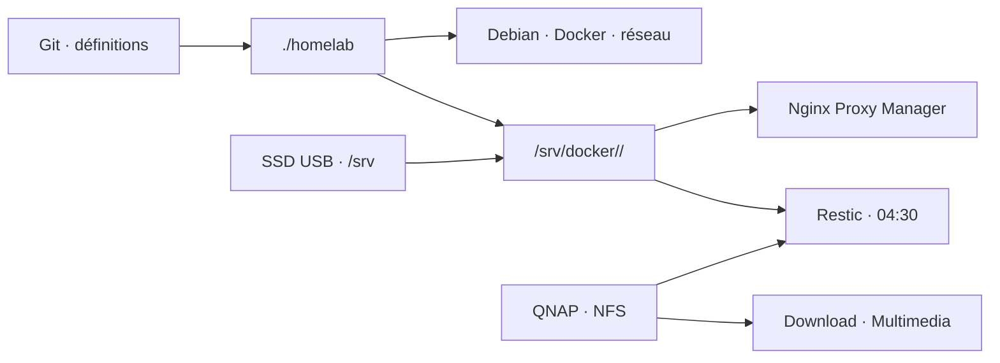

# Homelab · Raspberry Pi 4

> Un homelab Docker reproductible, lisible et sauvegardé — sans dépendre de
> manipulations oubliées sur le serveur.


Ce dépôt décrit l’hôte `rpi4`, ses montages et ses services. Les fichiers
Compose sont versionnés ici, les données vivent sous `/srv/docker`, les médias
sur SSD et NAS, et Restic sauvegarde ce qui ne peut pas être reconstruit.

## Démarrage rapide

Sur une installation Debian 13 arm64 fraîche :

```bash
git clone git@github.com:Eldayia/homelab.git ~/homelab
cd ~/homelab
chmod +x homelab

# Créer puis relire la configuration de la machine
./homelab init
nano config/homelab.env

# Préparer l'hôte, le réseau et les stockages
sudo ./homelab setup host
sudo ./homelab setup network          # prévisualisation
sudo ./homelab setup network --apply  # peut couper la session SSH
sudo ./homelab setup storage
sudo ./homelab setup media
sudo ./homelab setup backup

# Déployer progressivement
./homelab stack up infrastructure
./homelab stack up monitoring
./homelab stack up download media
./homelab check
```

Les `.env` de chaque service sont créés au premier déploiement dans
`/srv/docker/<catégorie>/<service>`. Remplacer leurs valeurs `CHANGE_ME`, puis
relancer la commande `stack up`.

> [!CAUTION]
> La préparation du disque et l’application du réseau sont volontairement
> interactives. Lire le récapitulatif affiché avant de confirmer.

## Les commandes à retenir

```bash
./homelab status                         # état de tout le homelab
./homelab stack list                     # catalogue des services
./homelab stack up radarr                 # déployer un service
./homelab stack pull monitoring           # télécharger les mises à jour
./homelab stack up monitoring             # les appliquer
./homelab backup status                   # état des sauvegardes
./homelab backup run                      # sauvegarde immédiate
./homelab check                           # validation complète du dépôt
```

Lancer `./homelab help` pour l’aide complète. Les scripts spécialisés restent
disponibles dans `scripts/`, mais ne sont normalement pas appelés directement.

## Architecture réelle



| Zone | Emplacement | Contenu |
|---|---|---|
| dépôt Git | `~/homelab` | scripts, Compose et documentation |
| données applicatives | `/srv/docker` | configuration et état des conteneurs |
| téléchargements locaux | `/srv/media/downloads` | données temporaires sur SSD |
| médias NAS | `/mnt/nas/*` | partages QNAP `Download` et `Multimedia` |
| sauvegardes | `/mnt/qnap-backups` | dépôt Restic chiffré |

## Organisation du dépôt

```text
homelab/
├── homelab                 commande unique
├── config/                 configuration Debian, SSH, réseau et systemd
├── docs/                   guides par tâche
├── inventory/              manifeste des services et audit de référence
├── scripts/                implémentation et garde-fous
└── stacks/
    ├── infrastructure/     DNS, reverse proxy, WireGuard
    ├── monitoring/         supervision et portail
    ├── download/           clients protégés par le VPN
    └── media/              indexation et gestion des médias
```

Le manifeste [`inventory/stacks.manifest`](inventory/stacks.manifest) est le
catalogue lu par le déploiement. Ajouter un dossier Compose sans l’y déclarer
ne déploie rien.

## Documentation

| Je veux… | Guide |
|---|---|
| comprendre les flux, réseaux et stockages | [Architecture](docs/architecture.md) |
| exploiter, mettre à jour ou diagnostiquer | [Exploitation](docs/operations.md) |
| connaître les services et leurs catégories | [Services](docs/services.md) |
| configurer la chaîne médias | [Media stack](docs/media-stack.md) |
| gérer les secrets sans les exposer | [Secrets](docs/secrets.md) |
| restaurer après une panne | [Reprise après sinistre](docs/disaster-recovery.md) |

L’[index de la documentation](docs/README.md) propose aussi un parcours selon
la tâche en cours.

## Principes du projet

- **Git décrit, `/srv` exécute** : aucune donnée applicative n’est committée.
- **Une stack, un dossier** : diagnostic et restauration restent ciblés.
- **Pas de volume Docker opaque** : les données persistantes sont des bind mounts.
- **Pas de secret dans Git** : les exemples documentent seulement les clés.
- **Déploiement progressif** : infrastructure, monitoring, puis médias.
- **Reconstruction testable** : `./homelab check` valide scripts et Compose.

---

État de référence : Raspberry Pi 4 · Debian 13 arm64 · structure auditée par
SSH le 18 août 2026.
