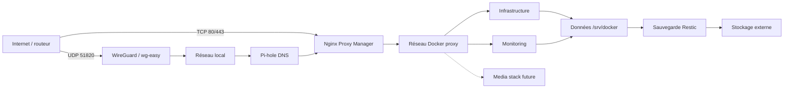

# Architecture

## Vue d’ensemble

## Séparation des responsabilités

- `config/` décrit le système hôte : APT, réseau, SSH, pare-feu et systemd ;
- `stacks/<catégorie>/<stack>/` contient uniquement la définition déployable ;
- `inventory/stacks.manifest` sélectionne les stacks connues et actives ;
- `/srv/docker/<stack>` reçoit les Compose, secrets locaux et données ;
- Restic sauvegarde l’état qui ne peut pas être reconstruit depuis Git.

Le niveau de catégorie n’est volontairement pas recopié sous `/srv/docker`.
Cette convention permet de réorganiser le dépôt sans déplacer les volumes déjà
en production.

## Hôte actuel et portabilité

La plateforme validée est un Raspberry Pi 4 arm64 sous Debian/Raspberry Pi OS
13, avec Docker Engine et le plugin Compose. L’adresse actuelle est documentée
dans `config/network.env.example`, mais les Compose utilisent des variables
pour les liaisons dépendantes de l’hôte.

Pour migrer vers un autre matériel :

1. vérifier que l’OS fournit les paquets de `inventory/apt-packages.txt` ;
2. vérifier la prise en charge de l’architecture par chaque image ;
3. adapter le réseau, le pare-feu, les montages et les unités systemd ;
4. restaurer `/srv/docker`, puis valider les Compose avant leur démarrage.

Les fichiers `config/apt/raspi.sources`, `rpi-guard.nft` et
`rpi-firewall.service` restent spécifiques à l’hôte actuel.

## Réseau

Le réseau Docker externe `proxy` relie Nginx Proxy Manager aux interfaces web.
Le script de déploiement le crée si nécessaire. Les services d’administration
directe sont liés à l’adresse LAN paramétrée ; seuls HTTP/HTTPS et WireGuard
sont destinés à une redirection depuis Internet.

Pi-hole publie TCP/UDP 53 sur l’hôte. wg-easy utilise le réseau hôte et
`/dev/net/tun`. Les autres services privilégient `expose` et le réseau `proxy`.

## État et données

Git permet de reconstruire l’hôte et les définitions Docker, mais pas l’état des
applications. La reprise complète dépend donc de ce dépôt et de la sauvegarde
Restic chiffrée contenant `/srv/docker` et ses secrets locaux.
