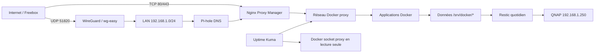

# Architecture

## Vue d'ensemble

## Hôte

- Raspberry Pi 4 arm64 ;
- Debian 13 (Trixie), noyau Raspberry Pi 6.18 ;
- hostname `rpi4`, IP fixe `192.168.1.240/24` ;
- passerelle `192.168.1.1`, fuseau `Europe/Paris` ;
- Docker Engine et Compose ;
- `/srv/docker/<stack>` pour les configurations et données ;
- réseau Docker partagé `proxy` pour les services publiés via NPM.

## Exposition réseau

- publics : TCP 80/443 vers NPM et UDP 51820 vers WireGuard ;
- LAN uniquement : SSH 22, NPM 81, Pi-hole 8085, Portainer 9443,
  wg-easy 51821, Cockpit 9090 et PCP ;
- DNS Pi-hole : TCP/UDP 53 sur l'hôte ;
- les autres applications utilisent `expose` et le réseau `proxy`, sans port
  publié sur l'hôte.

Pi-hole rejoint aussi `proxy` afin que NPM le contacte sur `pihole:80`, tout en
gardant son administration directe liée à `192.168.1.240:8085`. wg-easy utilise
le réseau hôte et `/dev/net/tun`; sa route NPM cible donc
`192.168.1.240:51821`, pas un nom de conteneur.

Le pare-feu est défini dans `config/nftables/rpi-guard.nft`. Il autorise le LAN,
le sous-réseau WireGuard `10.42.42.0/24`, les réseaux Docker
`172.16.0.0/12`, HTTP/HTTPS, WireGuard et ICMP/ICMPv6.

## État et données

Les fichiers Compose sont reproductibles, mais l'état des applications ne l'est
pas : NPM, Pi-hole, Kuma, Homarr, Vaultwarden, Forgejo et les autres services
conservent leurs données sous `/srv/docker`. La reconstruction complète dépend
donc de deux sources :

1. ce dépôt Git pour l'hôte et l'orchestration ;
2. Restic pour les données, bases, certificats et secrets locaux.
